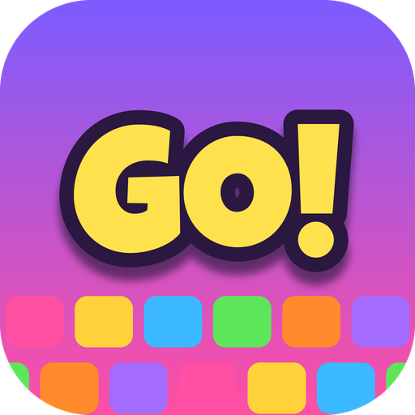
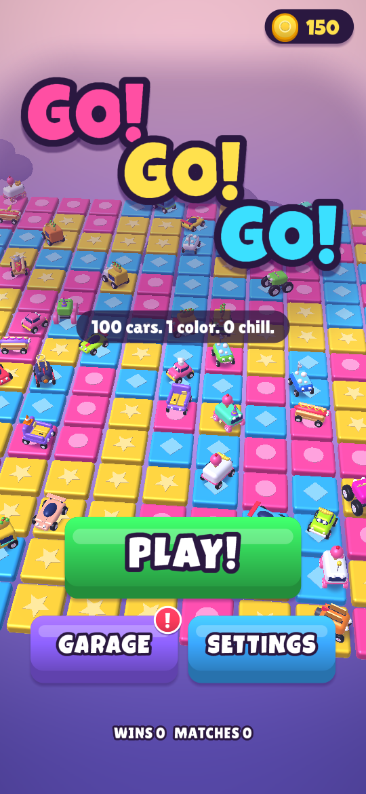
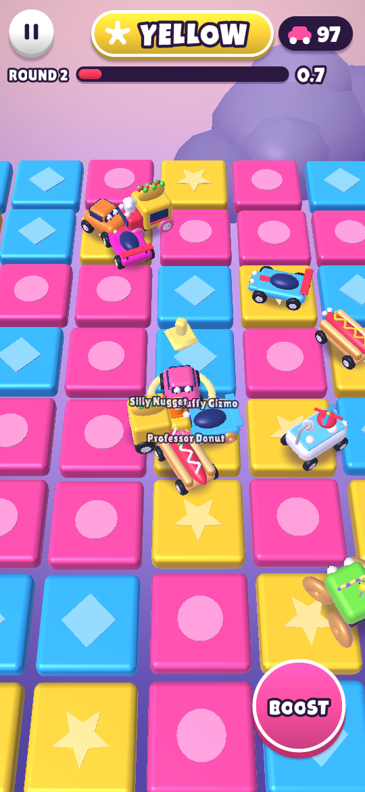
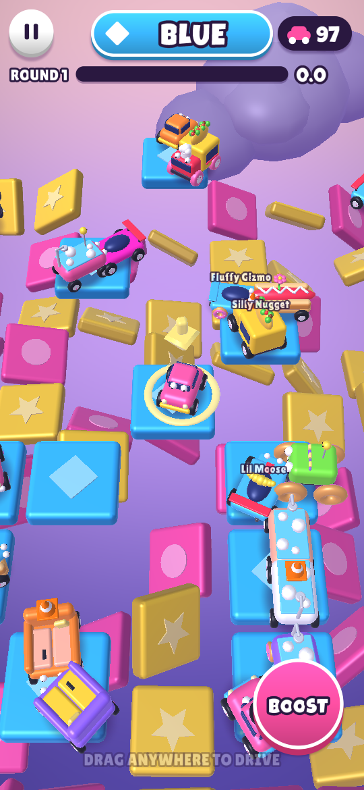
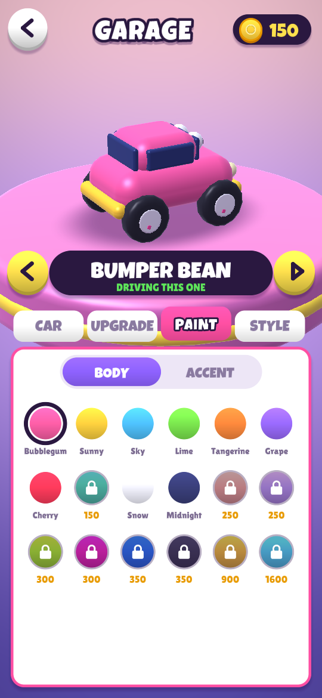
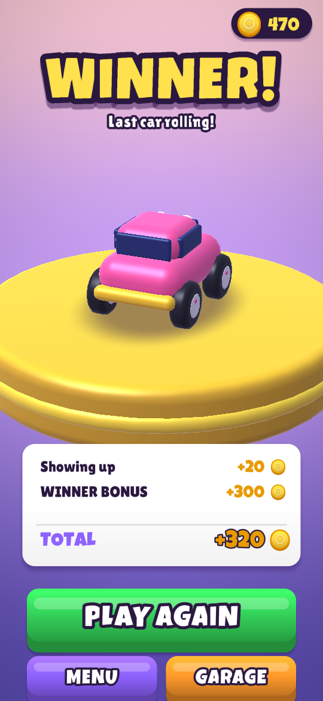

<p align="center"></p>

<h1 align="center">GO! GO! GO!</h1>

<p align="center"><b>100 cars. 1 color. 0 chill.</b><br>
A frantic, slapstick, hyper-casual party racer for Android.</p>

<p align="center">





</p>

## How to play

You and 99 other drivers spawn on a giant checkered grid of colorful tiles floating in the sky.

1. The bar at the top shows a **color** (and its symbol) and a **timer**.
2. Drive onto a tile of that color before the timer runs out.
3. When time is up, **every other tile drops out of the sky** — along with everyone standing on it.
4. The tiles come back in brand-new random colors, the next color is shown and the timer starts right away.
5. The timer keeps getting shorter as the match goes on (not necessarily every round), and target tiles get rarer.

**Last car standing wins.** If everyone left falls off at the same time, it's a **tie**.

Bump, shove and boost into other cars to knock them off their tile — but watch your own edges!

### Controls (landscape)

| Action | How |
| --- | --- |
| Steer | Hold the **◀ / ▶** arrow buttons (bottom left) |
| Gas / brake | Hold **GAS** / **BRAKE** (bottom right) — keep braking to reverse |
| Boost | Tap **BOOST** (above GAS, has a cooldown) — boosted cars hit much harder |
| Camera | Camera button (top right): **NEAR**, **FAR** or **HOOD** view |
| Pause | Pause button, top left (or Android back) |

"Swap controls" in the settings mirrors the arrows and pedals for left-handed play.

When you're knocked out you can **watch** the rest of the match or skip to the results.

## Progression

* Earn **coins** every match: for showing up, rounds survived, bonks (cars you knocked out) and your final placement.
* **Garage**: buy new cars, each with different Speed / Grip / Boost / Weight:
  Bumper Bean, Zoomba, Taco Truck, Hot Dog, Ice Scream, Monster Cube, Rocket Toaster, Bathtub Bomber and Sofa So Good.
* **Upgrade** every stat of every car (5 levels each).
* **Customize**: body paint, accent paint (18 colors incl. animated Rainbow), toppers (traffic cone, propeller cap, crown, shark fin, ...) and wheels (candy, donut, gold, ...).
* **Settings**: sound, music, vibration, camera shake, color symbols (for color-blind players), swap controls.

## Install

Grab the signed APK from the [Releases](../../releases) page (or from `releases/` in this repo), copy it to an Android phone and open it. Requires Android 7.0+ (API 24) and OpenGL ES 3.0. The game runs in landscape.

## Building

### Android Studio / Gradle

Open the project in Android Studio, or:

```bash
./gradlew assembleRelease
# -> app/build/outputs/apk/release/GOGOGO-<version>-release.apk
```

The GitHub Actions workflow (`.github/workflows/android.yml`) builds the APK on every push to `main` and attaches it to a GitHub Release whenever a `v*` tag is pushed.

### Without Gradle

`tools/build-apk.sh` builds the same signed APK with plain SDK tools (javac, d8/dx, aapt2, zipalign, apksigner). It picks tools from `$ANDROID_HOME` or the `PATH`, so Debian/Ubuntu's packaged Android tools work too:

```bash
sudo apt install android-sdk-platform-23 aapt dalvik-exchange zipalign apksigner
tools/build-apk.sh            # -> build/GOGOGO-release.apk
```

### Signing

Release builds are signed with `keystore/gogogo-release.jks` (passwords in `keystore/keystore.properties`). This is a development key so that updated builds install over older ones; **replace it with your own private key before publishing to Google Play.**

### Versioning

`version.properties` holds `versionCode` / `versionName` for both build paths.

## Tech

No game engine and no third-party runtime libraries — everything is custom and generated:

* `app/src/main/java/com/gogogo/game/engine` — a small OpenGL ES 3.0 engine: instanced renderer with toy-plastic lighting, fog and soft blob shadows; procedural mesh builder (rounded boxes, lathes, extrusions); signed-distance-field text; immediate-mode UI.
* `app/src/main/java/com/gogogo/game/game` — the game: match rules, arcade car physics with bumping, bot AI, screens.
* `app/src/main/java/com/gogogo/game/android` — Android activity and platform services.
* `tools/gen_font.py`, `tools/gen_icons.py`, `tools/gen_audio.py` — bake the font atlas, launcher icons, and synthesize all sound effects and music from scratch.

### Desktop test harness

The engine runs unchanged on desktop OpenGL ES (via LWJGL + Mesa), which makes it possible to script sessions and take screenshots without a device:

```bash
tools/desktop/run.sh 1280 720 "wait 60; shot title.png; tap 922 310; wait 300; shot match.png"
```

`SimTest` (in `tools/desktop`) runs headless bot-only matches to check round length and elimination pacing.

## Credits

* Fonts: [Luckiest Guy](https://fonts.google.com/specimen/Luckiest+Guy) by Astigmatic (Apache 2.0) and [Lilita One](https://fonts.google.com/specimen/Lilita+One) by Juan Montoreano (SIL OFL 1.1) — see `tools/fonts/`.
* Everything else (models, sounds, music, code) was made for this project.

## License

Apache 2.0 — see [LICENSE](LICENSE).
